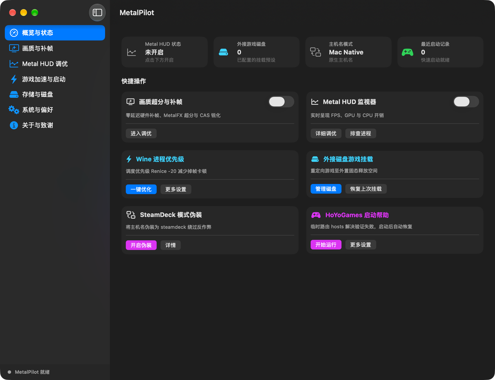
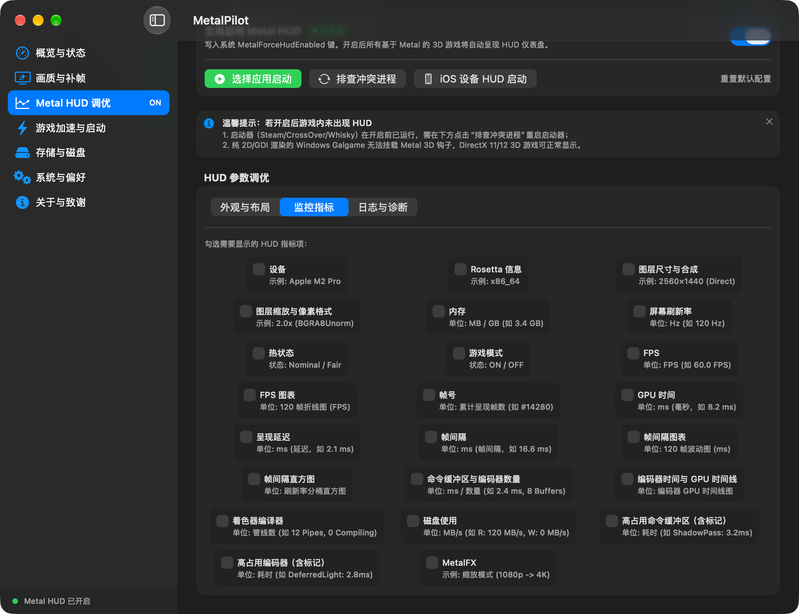
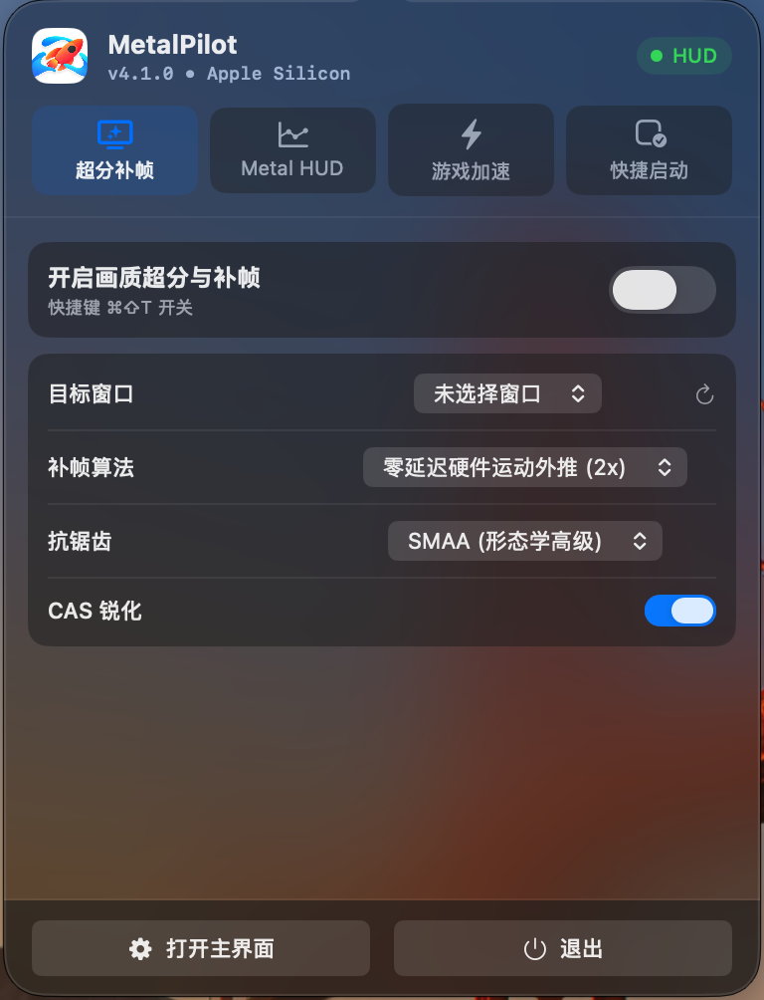

<p align="center">
  
</p>

<h1 align="center">MetalPilot</h1>

<p align="center">
  面向 Apple Silicon 游戏用户的原生游戏控制中心
</p>

<p align="center">
  <a href="README.md">简体中文</a> ·
  <a href="README_EN.md">English</a> ·
  <a href="README_JA.md">日本語</a>
</p>

<p align="center">
  
  
  
  
  
</p>

MetalPilot 将游戏启动、性能增强、Metal HUD、存档管理和系统状态整合到一个轻量的 macOS 原生应用中。它不试图替你接管游戏，而是让你在进入游戏前完成准备、运行中掌握状态、退出后保留可诊断的信息。

> **产品定位**：Apple Silicon 游戏体验的精密控制层。
> **设计原则**：原生、低干扰、可解释、可恢复。

---

## ✦ 主要能力

### 游戏启动与控制

- 从统一界面启动常用游戏和兼容层应用
- 管理最近运行的游戏与常用启动项
- 支持批量启动、启动参数和环境变量配置
- 提供菜单栏入口，减少游戏过程中对主窗口的依赖

### Metal HUD 与性能增强

- 调整 Metal HUD 的显示位置、透明度、缩放和指标集合
- 为不同游戏保存独立的 HUD 配置
- 支持全局快捷键切换 HUD 和鼠标约束
- 提供画面缩放、锐化、抗锯齿和动态补帧相关能力
- 识别可能干扰 HUD 注入的 Steam、CrossOver、Whisky 和 Wine 进程

### 游戏环境管理

- 探测 Windows 游戏常见的 `AppData` 与 `SavedGames` 存档位置
- 将存档打包为 ZIP，方便备份和迁移
- 管理常见缓存与临时文件
- 提供游戏专注模式，减少休眠和降频对游戏过程的影响
- 展示磁盘、系统、进程和游戏运行状态

### 诊断与恢复

- 导出包含系统版本、芯片信息、HUD 配置和进程状态的 Markdown 报告
- 提供核心功能检查和修复入口
- 对高权限操作采用明确的辅助服务流程
- 在清理和批量操作前进行授权与范围检查

---

## 🖥️ 界面预览

<p align="center">
  
  
</p>
<p align="center">
  
</p>

---

## 🚀 为什么是 MetalPilot

传统的“游戏工具箱”往往把许多开关堆在同一个页面里。MetalPilot 更关注完整的游戏流程：

```text
选择游戏 → 准备运行环境 → 启动 → 观察状态 → 诊断与恢复
```

它采用 SwiftUI、AppKit、Metal 相关能力和 macOS 原生服务构建，目标是让 Apple Silicon 用户获得更接近系统级工具的游戏体验，而不是再增加一个常驻的复杂调优面板。

---

## 📋 功能概览

| 能力 | MetalPilot |
|---|:---:|
| Apple Silicon 原生 ARM64 | ✅ |
| macOS 原生侧边栏界面 | ✅ |
| 深色 / 浅色外观 | ✅ |
| 简体中文 / English / 日本語 | ✅ |
| 菜单栏快速入口 | ✅ |
| Metal HUD 参数控制 | ✅ |
| 每个游戏独立 HUD 配置 | ✅ |
| 性能诊断快照导出 | ✅ |
| 冲突进程识别与安全重启 | ✅ |
| Windows 游戏存档探测与 ZIP 备份 | ✅ |
| 游戏专注防休眠模式 | ✅ |

---

## 💻 系统要求

- **操作系统**：macOS 26 Tahoe 或更高版本
- **硬件**：Apple Silicon，支持 M1、M2、M3、M4 及后续芯片
- **开发环境**：Xcode 16+、Swift 6、Command Line Tools
- **架构**：当前发布目标为 ARM64

> MetalPilot 面向 Apple Silicon 优先设计。Intel Mac 和旧版 macOS 不在当前发布目标内。

---

## 📦 获取与构建

### 获取源码

```bash
git clone https://github.com/Souitou-iop/MetalPilot.git
cd mac-gaming-toolbox
```

### 使用 Xcode 构建

打开 `MetalPilot.xcodeproj`，选择 `MetalPilot` scheme 后运行或构建。

### 使用发布脚本构建

```bash
ARCHS=arm64 ./Scripts/build-release.sh
./Scripts/package-zip.sh \
  "build/DerivedData/Build/Products/Release/MetalPilot.app" \
  "build/MetalPilot-arm64.zip"
```

构建产物默认位于 `build/`。签名、公证和特权辅助服务相关步骤请根据本机的 Developer ID 与权限环境执行。

---

## 🔐 权限与安全边界

部分系统级功能需要安装独立的特权辅助服务。MetalPilot 遵循以下原则：

- 普通 UI 进程不以 root 权限运行
- 高权限请求通过明确的 XPC 白名单处理
- 清理、hosts 修改、进程优先级调整等操作在执行前验证参数
- 诊断日志中不应包含密码、私钥或其他敏感凭据
- 建议在运行高权限操作前保留必要的系统和游戏配置备份

---

## 🧭 项目状态

MetalPilot 正处于持续重构阶段。品牌、界面和部分核心能力已经迁移到新的产品身份；旧版本用户的配置、辅助服务和升级兼容性仍需在真实安装环境中逐项验证。

如果你准备提交 Issue，请尽量附带：

1. macOS 版本和 Apple Silicon 型号
2. MetalPilot 版本
3. 游戏或兼容层名称
4. 可复现步骤
5. 脱敏后的诊断报告

---

## 🙏 致谢与来源

MetalPilot 基于原作者 **[@我是艾文喵](https://github.com/aiwentongxue)** 的开源项目进行重构和扩展。感谢原项目为 Apple Silicon 游戏生态、Wine / GPTK 转译和 macOS 游戏优化提供的基础工作。

- 原始项目：[aiwentongxue/mac-gaming-toolbox](https://github.com/aiwentongxue/mac-gaming-toolbox)
- 原作者：[我是艾文喵 · Bilibili](https://b23.tv/dV7YBJQ)
- 原作者：[YouTube](https://youtube.com/channel/UC0TgypOLHt2fXboVw34SKVQ)

---

## 📄 许可证

本项目遵循 [GNU General Public License v3.0](LICENSE) 开源。
