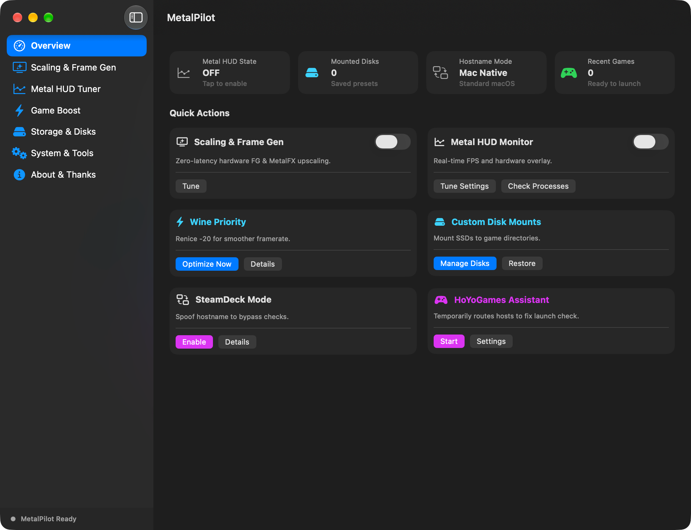
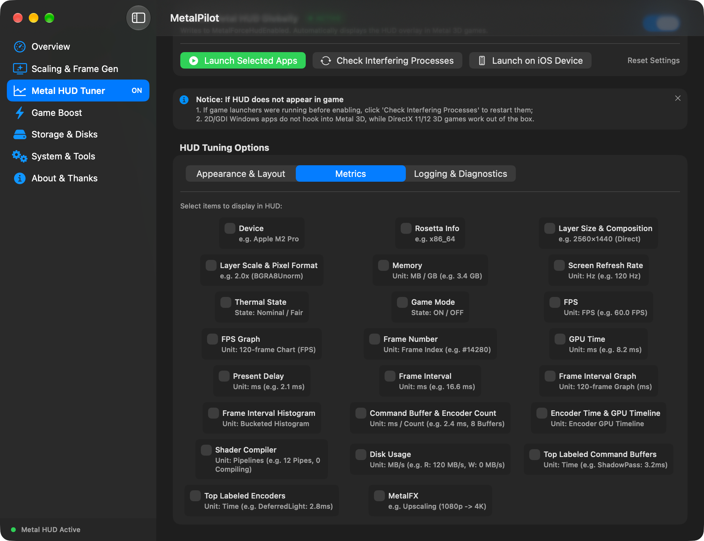
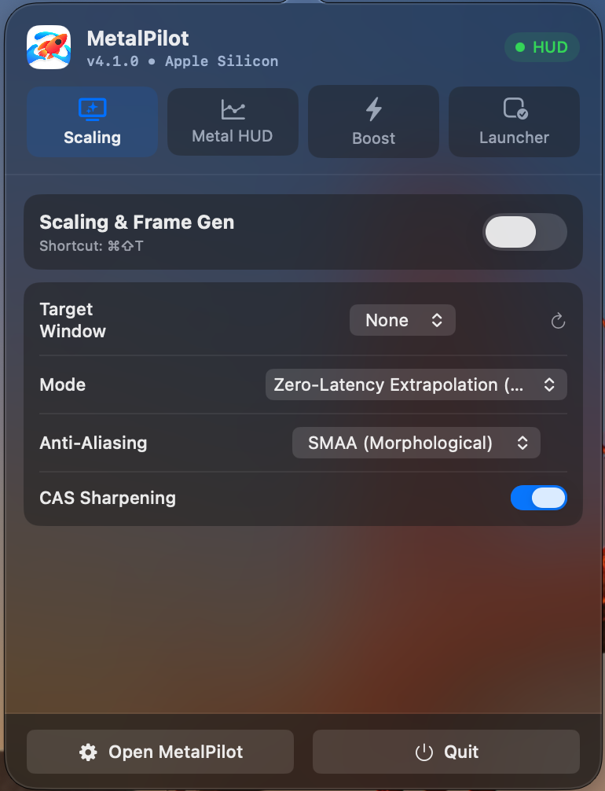

<p align="center">
  
</p>

<h1 align="center">MetalPilot</h1>

<p align="center">
  A native game control center for Apple Silicon gamers
</p>

<p align="center">
  <a href="README.md">简体中文</a> ·
  <a href="README_EN.md">English</a> ·
  <a href="README_JA.md">日本語</a>
</p>

<p align="center">
  
  
  
  
  
</p>

MetalPilot brings game launching, performance enhancement, Metal HUD, save management, and system status together in one lightweight, native macOS app. It doesn't try to take over your games — it helps you prepare before you launch, stay informed while you play, and keep diagnosable information after you quit.

> **Positioning**: A precision control layer for the Apple Silicon gaming experience.
> **Design principles**: Native, low-interference, explainable, recoverable.

---

## ✦ Key Capabilities

### Game Launching & Control

- Launch your usual games and compatibility-layer apps from one unified interface
- Manage recently played games and frequent launch items
- Batch launching with configurable launch arguments and environment variables
- Menu bar access to reduce dependence on the main window during play

### Metal HUD & Performance Enhancement

- Adjust Metal HUD position, opacity, scale, and metric sets
- Save independent HUD profiles for individual games
- Global hotkeys to toggle the HUD and mouse constraint
- Resolution scaling, sharpening, anti-aliasing, and dynamic frame generation
- Detects Steam, CrossOver, Whisky, and Wine processes that can interfere with HUD injection

### Game Environment Management

- Detects Windows-game save locations such as `AppData` and `Saved Games`
- Packages saves into ZIP archives for easy backup and migration
- Manages common caches and temporary files
- Gaming focus mode to reduce sleep and throttling during play
- Shows disk, system, process, and game status

### Diagnostics & Recovery

- Exports a Markdown report covering macOS version, chip info, HUD configuration, and process state
- Core feature checks and a repair entry point
- A clear privileged-helper flow for high-permission operations
- Authorization and scope checks before cleanup and batch operations

---

## 🖥️ Screenshots

<p align="center">
  
  
</p>
<p align="center">
  
</p>

---

## 🚀 Why MetalPilot

Traditional "gaming toolboxes" pile switches onto a single page. MetalPilot focuses on the complete gaming flow:

```text
Pick a game → Prepare the environment → Launch → Watch the status → Diagnose & recover
```

It is built with SwiftUI, AppKit, Metal, and native macOS services, aiming to give Apple Silicon users a system-grade gaming experience instead of yet another resident tuning panel.

---

## 📋 Feature Overview

| Capability | MetalPilot |
|---|:---:|
| Native Apple Silicon ARM64 | ✅ |
| Native macOS sidebar interface | ✅ |
| Dark / light appearance | ✅ |
| 简体中文 / English / 日本語 | ✅ |
| Menu bar quick access | ✅ |
| Metal HUD parameter control | ✅ |
| Per-game HUD profiles | ✅ |
| Performance diagnostic snapshot export | ✅ |
| Interfering-process detection & safe restart | ✅ |
| Windows save detection & ZIP backup | ✅ |
| Gaming focus anti-sleep mode | ✅ |

---

## 💻 System Requirements

- **OS**: macOS 26 Tahoe or later
- **Hardware**: Apple Silicon — M1, M2, M3, M4, and later chips
- **Development**: Xcode 16+, Swift 6, Command Line Tools
- **Architecture**: ARM64 is the current release target

> MetalPilot is designed Apple Silicon first. Intel Macs and older macOS versions are not current release targets.

---

## 📦 Get & Build

### Get the source

```bash
git clone https://github.com/Souitou-iop/MetalPilot.git
cd MetalPilot
```

### Build with Xcode

Open `MetalPilot.xcodeproj`, select the `MetalPilot` scheme, then run or build.

### Build with the release script

```bash
ARCHS=arm64 ./Scripts/build-release.sh
./Scripts/package-zip.sh \
  "build/DerivedData/Build/Products/Release/MetalPilot.app" \
  "build/MetalPilot-arm64.zip"
```

Build products land in `build/` by default. Signing, notarization, and the privileged helper steps depend on your local Developer ID and permission environment.

---

## 🔐 Permissions & Security Boundaries

Some system-level features require a separate privileged helper service. MetalPilot follows these principles:

- The regular UI process never runs as root
- High-permission requests go through an explicit XPC allowlist
- Cleanup, hosts edits, and process-priority changes validate parameters before executing
- Diagnostic logs must not contain passwords, private keys, or other sensitive credentials
- Keep necessary system and game configuration backups before high-permission operations

---

## 🧭 Project Status

MetalPilot is under active refactoring. Branding, UI, and part of the core capabilities have moved to the new product identity; configuration, the privileged helper, and upgrade compatibility for existing users still need verification in real installation environments, item by item.

If you want to file an issue, please include:

1. macOS version and Apple Silicon model
2. MetalPilot version
3. Game or compatibility layer name
4. Reproduction steps
5. A redacted diagnostic report

---

## 🙏 Credits & Acknowledgements

MetalPilot is a reworked and extended fork of the open-source project by **[@我是艾文喵](https://github.com/aiwentongxue)**. Many thanks to the original project's groundwork for the Apple Silicon gaming ecosystem, Wine / GPTK translation, and macOS game optimization.

- Original project: [aiwentongxue/mac-gaming-toolbox](https://github.com/aiwentongxue/mac-gaming-toolbox)
- Original author: [我是艾文喵 · Bilibili](https://b23.tv/dV7YBJQ)
- Original author: [YouTube](https://youtube.com/channel/UC0TgypOLHt2fXboVw34SKVQ)

---

## 📄 License

This project is released under the [GNU General Public License v3.0](LICENSE).
