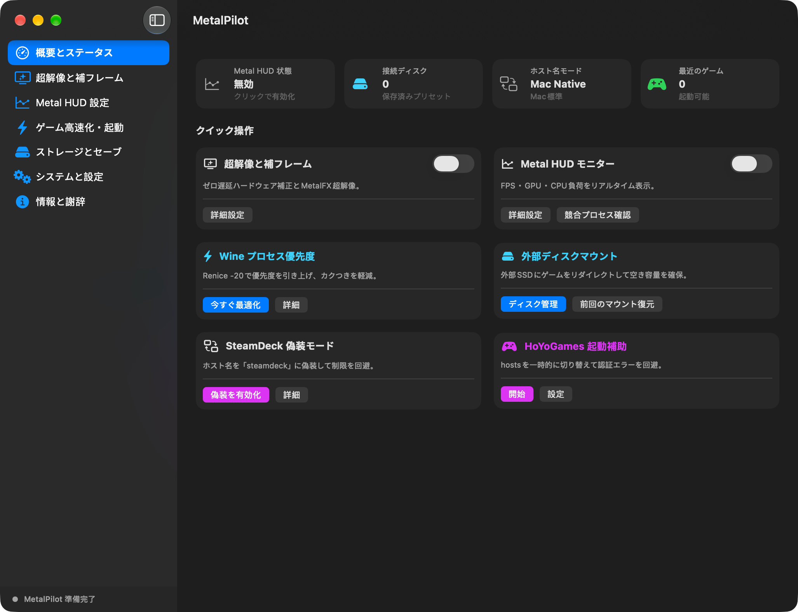
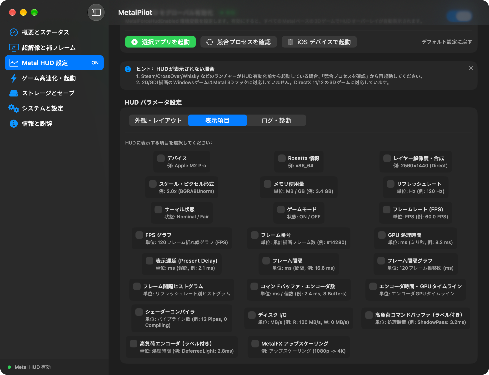
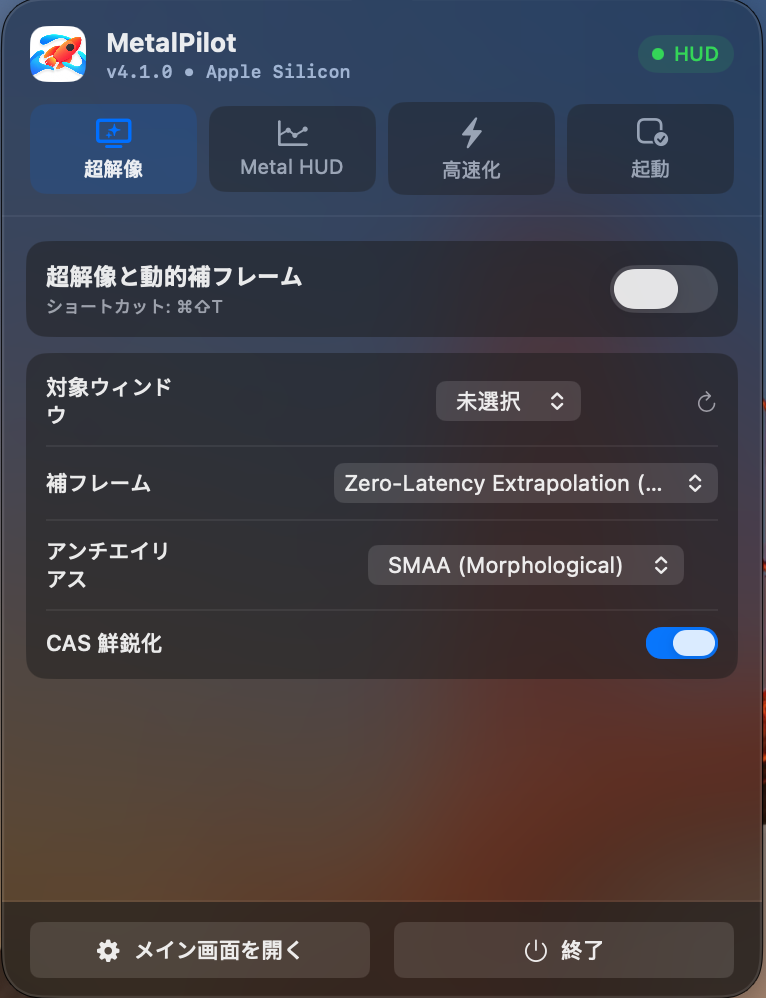

<p align="center">
  
</p>

<h1 align="center">MetalPilot</h1>

<p align="center">
  Apple Silicon ゲーマーのためのネイティブゲームコントロールセンター
</p>

<p align="center">
  <a href="README.md">简体中文</a> ·
  <a href="README_EN.md">English</a> ·
  <a href="README_JA.md">日本語</a>
</p>

<p align="center">
  
  
  
  
  
</p>

MetalPilot は、ゲームの起動、パフォーマンス強化、Metal HUD、セーブデータ管理、システム状態をひとつの軽量な macOS ネイティブアプリにまとめました。ゲームを代わりに操作するのではなく、起動前の準備、プレイ中の状態把握、終了後の診断情報をサポートします。

> **プロダクトポジション**：Apple Silicon ゲーム体験のための精密コントロールレイヤー。
> **デザイン原則**：ネイティブ・低干渉・説明可能・復元可能。

---

## ✦ 主な機能

### ゲーム起動とコントロール

- 統一された画面からよく使うゲームと互換レイヤーアプリを起動
- 最近実行したゲームとよく使う起動項目を管理
- 一括起動、起動引数、環境変数の設定に対応
- メニューバー入口を提供し、プレイ中にメインウィンドウへ戻る手間を減らす

### Metal HUD とパフォーマンス強化

- Metal HUD の表示位置・不透明度・スケール・表示指標を調整
- ゲームごとに独立した HUD 設定を保存
- HUD とマウス拘束を切り替えるグローバルショートカット
- 画質スケーリング、シャープ化、アンチエイリアス、動的補フレームに対応
- HUD 注入を妨げる可能性がある Steam・CrossOver・Whisky・Wine プロセスを識別

### ゲーム環境管理

- Windows ゲームで一般的な `AppData` や `SavedGames` のセーブ場所を検出
- セーブデータを ZIP にパッケージし、バックアップと移行を簡単に
- 一般的なキャッシュと一時ファイルを管理
- スリープや降頻の影響を減らすゲーム集中モード
- ディスク・システム・プロセス・ゲームの状態を表示

### 診断とリカバリー

- macOS バージョン、チップ情報、HUD 設定、プロセス状態を含む Markdown レポートを出力
- コア機能のチェックと修復入口を提供
- 高権限操作には明確なヘルパーサービスのフローを採用
- クリーンアップや一括操作の前に認可と範囲チェックを実施

---

## 🖥️ スクリーンショット

<p align="center">
  
  
</p>
<p align="center">
  
</p>

---

## 🚀 なぜ MetalPilot なのか

従来の「ゲームツールボックス」は多くのスイッチを 1 画面に並べがちです。MetalPilot はゲームの完全なフローに焦点を当てます：

```text
ゲームを選ぶ → 環境を整える → 起動 → 状態を確認 → 診断とリカバリー
```

SwiftUI、AppKit、Metal、macOS ネイティブサービスで構築され、常駐型の複雑なチューニングパネルをさらに増やすのではなく、システム級ツールに近いゲーム体験を Apple Silicon ユーザーに提供することを目指しています。

---

## 📋 機能概要

| 機能 | MetalPilot |
|---|:---:|
| Apple Silicon ネイティブ ARM64 | ✅ |
| macOS ネイティブサイドバー UI | ✅ |
| ダーク / ライト外観 | ✅ |
| 简体中文 / English / 日本語 | ✅ |
| メニューバークイック入口 | ✅ |
| Metal HUD パラメータ制御 | ✅ |
| ゲーム別の個別 HUD プロファイル | ✅ |
| パフォーマンス診断スナップショット出力 | ✅ |
| 競合プロセスの検出と安全な再起動 | ✅ |
| Windows ゲームセーブの検出と ZIP バックアップ | ✅ |
| ゲーム集中防スリープモード | ✅ |

---

## 💻 動作環境

- **OS**：macOS 26 Tahoe 以降
- **ハードウェア**：Apple Silicon（M1、M2、M3、M4 および以降のチップ）
- **開発環境**：Xcode 16+、Swift 6、Command Line Tools
- **アーキテクチャ**：現在のリリースターゲットは ARM64

> MetalPilot は Apple Silicon ファーストで設計されています。Intel Mac と旧 macOS は現在のリリースターゲット外です。

---

## 📦 入手とビルド

### ソースコードの入手

```bash
git clone https://github.com/Souitou-iop/MetalPilot.git
cd MetalPilot
```

### Xcode でビルド

`MetalPilot.xcodeproj` を開き、`MetalPilot` スキームを選んで実行またはビルドします。

### リリーススクリプトでビルド

```bash
ARCHS=arm64 ./Scripts/build-release.sh
./Scripts/package-zip.sh \
  "build/DerivedData/Build/Products/Release/MetalPilot.app" \
  "build/MetalPilot-arm64.zip"
```

ビルド成果物は既定で `build/` に生成されます。署名・公証・特権ヘルパー関連の手順は、お使いの Developer ID と権限環境に応じて実行してください。

---

## 🔐 権限とセキュリティ境界

一部のシステムレベル機能には独立した特権ヘルパーサービスが必要です。MetalPilot は以下の原則に従います：

- 通常の UI プロセスは root 権限で動作しない
- 高権限リクエストは明示的な XPC 許可リストを通して処理
- クリーンアップ・hosts 編集・プロセス優先度の変更は、実行前にパラメータを検証
- 診断ログにパスワード・秘密鍵などの機密情報を含めない
- 高権限操作の前に、必要なシステムとゲーム設定のバックアップを推奨

---

## 🧭 プロジェクトの状況

MetalPilot は継続的にリファクタリングを進めています。ブランド・UI・コア機能の一部は新しいプロダクトアイデンティティへ移行済みです。既存ユーザーの設定・ヘルパーサービス・アップグレード互換性については、実際のインストール環境で項目ごとの検証が継続中です。

Issue を報告する場合は、以下の情報を添えていただけると助かります：

1. macOS バージョンと Apple Silicon の型番
2. MetalPilot のバージョン
3. ゲームまたは互換レイヤー名
4. 再現手順
5. マスキング済みの診断レポート

---

## 🙏 謝辞と来源

MetalPilot は原作者 **[@我是艾文喵](https://github.com/aiwentongxue)** 氏のオープンソースプロジェクトをリファクタリング・拡張したものです。Apple Silicon ゲームエコシステム、Wine / GPTK トランスレーション、macOS ゲーム最適化への原プロジェクトの基礎的な貢献に感謝します。

- 原プロジェクト：[aiwentongxue/mac-gaming-toolbox](https://github.com/aiwentongxue/mac-gaming-toolbox)
- 原作者：[我是艾文喵 · Bilibili](https://b23.tv/dV7YBJQ)
- 原作者：[YouTube](https://youtube.com/channel/UC0TgypOLHt2fXboVw34SKVQ)

---

## 📄 ライセンス

本プロジェクトは [GNU General Public License v3.0](LICENSE) の下で公開されています。
